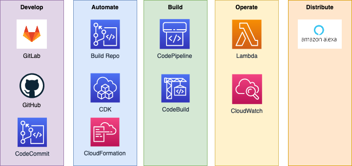
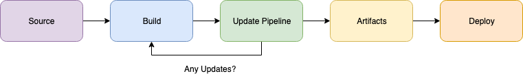

# Alexa Skils - CI/CD CDK Pipeline

This repository will help you setting up a CI/CD pipeline for
your Alexa Skills.  
This pipeline is powered by AWS Cloud Development Kit (CDK), CloudFormation 
CodePipeline and CodeBuild.  

This repository is meant to help you getting started with Alexa Skills Development
by adopting GitOps to manage changes to business logic and supporting
infrastructure. 

## Solution Overview
  
This solution is designed to automate the promotion of changes to business logic
and infrastructure supporting your Alexa Skill. In the **Develop** phase,
you make changes to the source code and commit to a form of source code versioning 
system. In the **Automate** phase, you use scripts and GitOps features to trigger changes 
to the state of your application. In the **Build** phase, you delegate the building of 
executable articacts and other assets to a designated environment.
In the **Operate** phase, you create infrastructure able to run and monitor your
application.  In the **Distribute** phase, you make your application available to
your target audiences.

### Pipeline Steps
  
The pipeline itslef has 5 steps:
- **Source** is triggered by a new commit pushed to a monitored branch of the
Build Repository. In this example, the Build Repository is separated from the 
Development Repository. This is to decouple the development source hosted in a
central repository and the repository deployed in your AWS account. The goal of 
this step is to check out the latest commit and evaluate if any changes need to
be propagated.
- **Build** is triggered by the previous step. Its goal is to compile executable
artifacts and assets.
- **Update Pipeline** checks if the source code of the pipeline itslef has been 
changed in the latest commit. If so, changes to the pipeline are applied and the 
build step is restarted.
- **Artifacts** publishes the articacts built at the previous stage.
- **Deploy** triggers the creation of the supporting infrastructure and deployment 
of the artifacts previously built.

## Cloud9 Environment Setup
The recommendation is that you run the first deployment from an AWS Cloud9
Environment making use of an IAM role that is able to create infrastructure via 
CloudFormation and IAM Roles. The recommended OS is Amazon Linux2.  
You can [follow this tutorial](https://docs.aws.amazon.com/cloud9/latest/user-guide/tutorial-create-environment.html)
to set up your Cloud9 environment.  

### ASK CLI
If you haven't done this before, please install and configure [ASK CLI](https://www.npmjs.com/package/ask-cli) by following these instructions. You'll have to run this procedure only once per Cloud9 environment.  
In your Cloud9 terminal
1. install CLI tool
```
npm install -g ask-cli
```
2. configure the ASK profile
```
ask configure --no-bowser
```
3. When asked if you want to link your AKS profile to your AWS account, say no.

### Expand your disk
Follow [these instructions](https://docs.aws.amazon.com/cloud9/latest/user-guide/move-environment.html#move-environment-resize) to expand your Cloud9 Environment disk. We recommend a disk size of at least 20GiB.

### AWS Credentials
Your AWS Credentials should already be available in your Cloud9 Environment.  
If you're not using Cloud9, you can verify this by running the following command  
```bash
aws configure
```

## Preparing your Amazon Developer Account
To create and manage Alexa Skills via CDK, you will need to provide Alexa Developer account credentials, which are separate from our AWS credentials. The following values must be supplied in order to authenticate:

- **Vendor ID**: Represents the Alexa Developer account.
- **Client ID**: Represents the developer, tool, or organization requiring permission to perform a list of operations on the skill. In this case, our AWS CDK project.
- **Client Secret**: The secret value associated with the Client ID.
- **Refresh Token**: A token for reauthentication. The ASK service uses access tokens for authentication that expire one hour after creation. Refresh tokens do not expire and can retrieve a new access token when needed.

### Get Alexa Developer Vendor ID

Easily retrieve your Alexa Developer Vendor ID from the Alexa Developer Console.

- Navigate to the Alexa Developer console and login with your Amazon account.
- After logging in, on the main screen click on the “Settings” tab.


- Your Vendor ID is listed in the “My IDs” section. Note this value.


### Create Login with Amazon (LWA) Security Profile

The Skill Management API utilizes Login with Amazon (LWA) for authentication, so first we must create a security profile for LWA under the same Amazon account that we will use to create the Alexa Skill.

- Navigate to the [LWA console](https://developer.amazon.com/loginwithamazon/console/site/lwa/overview.html) and login with your Amazon account.
- Click the “Create a New Security Profile” button.


- Fill out the form with a Name, Description, and Consent Privacy Notice URL, and then click “Save”.


- The new Security Profile should now be listed. Hover over the gear icon, located to the right of the new profile name, and click “Web Settings”.


- Click the “Edit” button and add the following under “Allowed Return URLs”:

```
http://127.0.0.1:9090/cb
https://s3.amazonaws.com/ask-cli/response_parser.html
https://ask-cli-static-content.s3-us-west-2.amazonaws.com/html/ask-cli-no-browser.html 
```

- Click the “Save” button to save your changes.
- Click the “Show Secret” button to reveal your Client Secret. Note your Client ID and Client Secret.


## Environmental Variables
In the root of this repository, create the following file to export your Amazon 
Developer Console credentials, Login with Amazon Credentials and other variables
the deployment will make use of.  
```bash
touch .env
```
Add your credentials and custom values to this file.
```bash
export ALEXA_VENDOR_ID=<YOUR-VALUE-HERE>
export ALEXA_CUSTOMER_ID=<YOUR-VALUE-HERE>
export LWA_CLIENT_ID=<YOUR-VALUE-HERE>
export LWA_CLIENT_SECRET=<YOUR-VALUE-HERE>
export SKILL_STACK_NAME=<YOUR-VALUE-HERE>
```

This file will be sourced at deploy time to safely store your credentials in AWS SSM 
Parameter Store and Secrets Manager.


## Deployment
Run the following command
```bash
./scripts/00-deploy.sh
```
This script has a few interactive steps, please follow its instruction.  
It will 
- install local dependencies, such as `jq` and `npm` packages
- generate a LWA refresh token
- safely store your credentials in your AWS account via SSM Parameter Store and Secrets Manager
- deploy the pipeline via CDK

The script will fail if any of the expected environment variables are missing.  

### Build Repo
Now that the pipeline has been deployed to your AWS account, it will monitor the
branch `feature/pipeline` of a CodeCommit Build Repository deployed by the same stack.  
To connect this repository to the Build Repository, run the following command  
```bash
./scripts/10-build-repo.sh
```
This will add a new remote to this repository pointing to the Build Repository.  
The new remote is called `build`. The script will also checkout 

### Triggering a Build
Push to the `build` remote to trigger a build.  
```bash
git push build feature/pipeline
```

## Security

See [CONTRIBUTING](CONTRIBUTING.md#security-issue-notifications) for more information.

## License

This sample is licensed under the Amazon Software License.


## References

- [CDK for Alexa Skils](https://aws.amazon.com/blogs/devops/deploying-alexa-skills-with-aws-cdk/).